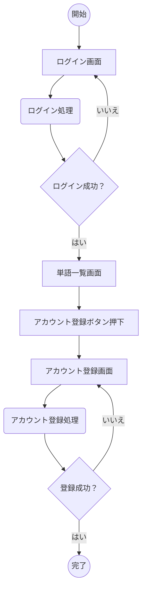

```mermaid
flowchart TD
    A((開始)) --> B[ログイン画面]
    B --> C(ログイン処理)
    C --> D{ログイン成功？}
    D -- はい --> E[単語一覧画面]
    D -- いいえ --> B

    E --> F[アカウント登録ボタン押下]
    F --> G[アカウント登録画面]
    G --> H(アカウント登録処理)
    H --> I{登録成功？}
    I -- はい --> J((完了))
    I -- いいえ --> G
```