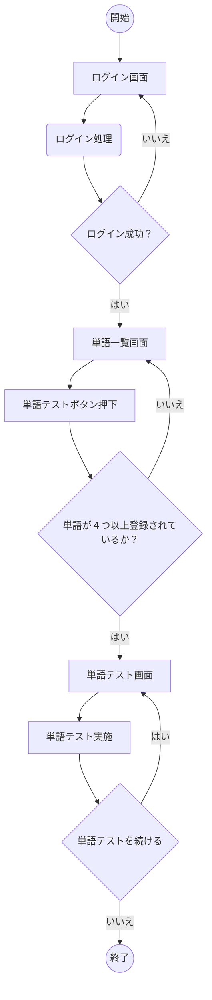

```mermaid
flowchart TD
    A((開始)) --> B[ログイン画面]
    B --> C(ログイン処理)
    C --> D{ログイン成功？}
    D -- はい --> E[単語一覧画面]
    D -- いいえ --> B

    E --> F[単語テストボタン押下]
    F --> G{単語が４つ以上登録されているか？}
    G -- はい --> H[単語テスト画面]
    G -- いいえ --> E
    H --> I[単語テスト実施]
    I --> J{単語テストを続ける}
    J -- はい --> H
    J -- いいえ --> L((終了))
```