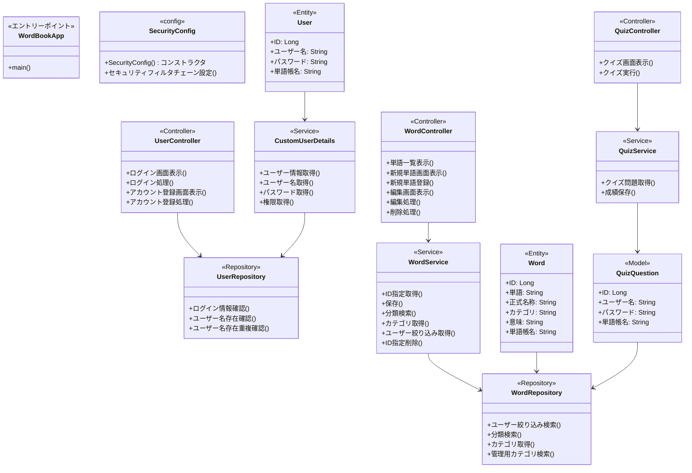

```mermaid
classDiagram

class WordBookApp {
    <<エントリーポイント>>
    +main()
}

class SecurityConfig {
    <<config>>
    +SecurityConfig() コンストラクタ
    +セキュリティフィルタチェーン設定()
}

class UserController {
    <<Controller>>
    +ログイン画面表示()
    +ログイン処理()
    +アカウント登録画面表示()
    +アカウント登録処理()
}

class WordController {
    <<Controller>>
    +単語一覧表示()
    +新規単語画面表示()
    +新規単語登録()
    +編集画面表示()
    +編集処理()
    +削除処理()
}

class QuizController {
    <<Controller>>
    +クイズ画面表示()
    +クイズ実行()
}

class UserRepository {
    <<Repository>>
    +ログイン情報確認()
    +ユーザー名存在確認()
    +ユーザー名存在重複確認()
}

class WordRepository {
    <<Repository>>
    +ユーザー絞り込み検索()
    +分類検索()
    +カテゴリ取得()
    +管理用カテゴリ検索()
}

class WordService {
    <<Service>>
    +ID指定取得()
    +保存()
    +分類検索()
    +カテゴリ取得()
    +ユーザー絞り込み取得()
    +ID指定削除()
}

class QuizService {
    <<Service>>
    +クイズ問題取得()
    +成績保存()
}

class QuizQuestion {
    <<Model>>
    +ID: Long
    +ユーザー名: String
    +パスワード: String
    +単語帳名: String
}

class CustomUserDetails {
    <<Service>>
    +ユーザー情報取得()
    +ユーザー名取得()
    +パスワード取得()
    +権限取得()
}

class User {
    <<Entity>>
    +ID: Long
    +ユーザー名: String
    +パスワード: String
    +単語帳名: String
}

class Word {
    <<Entity>>
    +ID: Long
    +単語: String
    +正式名称: String
    +カテゴリ: String
    +意味: String
    +単語帳名: String
}

%% 関係（矢印）
UserController --> UserRepository
CustomUserDetails --> UserRepository
User --> CustomUserDetails
WordController --> WordService
WordService --> WordRepository
Word --> WordRepository
QuizController --> QuizService
QuizService --> QuizQuestion
QuizQuestion --> WordRepository
```