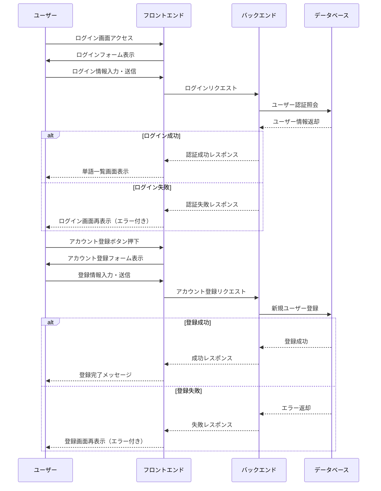

```mermaid
sequenceDiagram
    participant ユーザー
    participant フロントエンド
    participant バックエンド
    participant データベース

    ユーザー->>フロントエンド: ログイン画面アクセス
    フロントエンド->>ユーザー: ログインフォーム表示

    ユーザー->>フロントエンド: ログイン情報入力・送信
    フロントエンド->>バックエンド: ログインリクエスト
    バックエンド->>データベース: ユーザー認証照会
    データベース-->>バックエンド: ユーザー情報返却
    alt ログイン成功
        バックエンド-->>フロントエンド: 認証成功レスポンス
        フロントエンド-->>ユーザー: 単語一覧画面表示
    else ログイン失敗
        バックエンド-->>フロントエンド: 認証失敗レスポンス
        フロントエンド-->>ユーザー: ログイン画面再表示（エラー付き）
    end

    ユーザー->>フロントエンド: アカウント登録ボタン押下
    フロントエンド->>ユーザー: アカウント登録フォーム表示

    ユーザー->>フロントエンド: 登録情報入力・送信
    フロントエンド->>バックエンド: アカウント登録リクエスト
    バックエンド->>データベース: 新規ユーザー登録
    alt 登録成功
        データベース-->>バックエンド: 登録成功
        バックエンド-->>フロントエンド: 成功レスポンス
        フロントエンド-->>ユーザー: 登録完了メッセージ
    else 登録失敗
        データベース-->>バックエンド: エラー返却
        バックエンド-->>フロントエンド: 失敗レスポンス
        フロントエンド-->>ユーザー: 登録画面再表示（エラー付き）
    end

```
