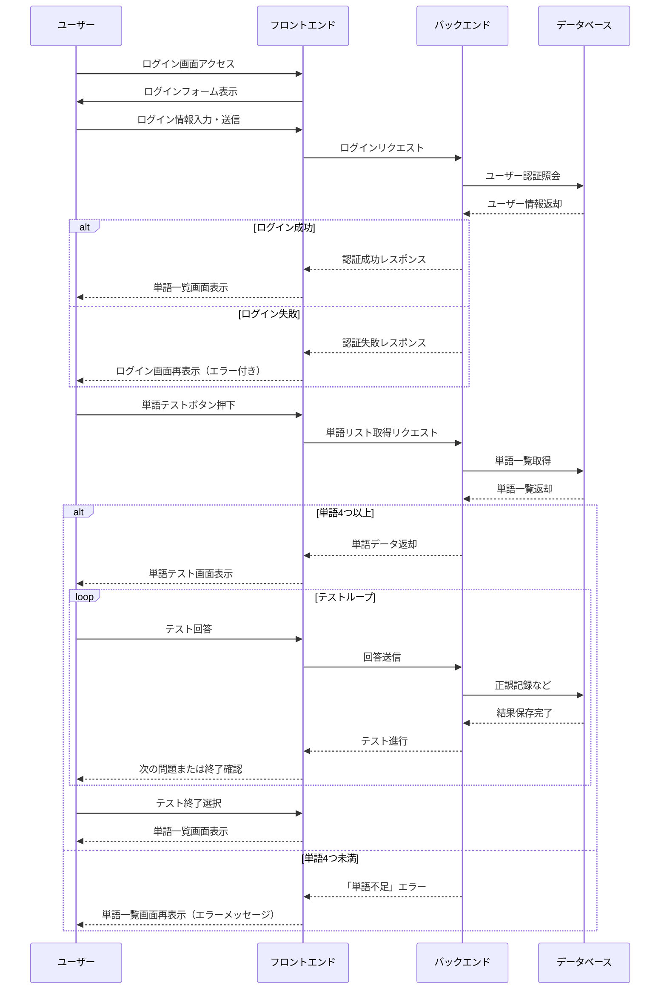

```mermaid
sequenceDiagram
    participant ユーザー
    participant フロントエンド
    participant バックエンド
    participant データベース

    ユーザー->>フロントエンド: ログイン画面アクセス
    フロントエンド->>ユーザー: ログインフォーム表示

    ユーザー->>フロントエンド: ログイン情報入力・送信
    フロントエンド->>バックエンド: ログインリクエスト
    バックエンド->>データベース: ユーザー認証照会
    データベース-->>バックエンド: ユーザー情報返却
    alt ログイン成功
        バックエンド-->>フロントエンド: 認証成功レスポンス
        フロントエンド-->>ユーザー: 単語一覧画面表示
    else ログイン失敗
        バックエンド-->>フロントエンド: 認証失敗レスポンス
        フロントエンド-->>ユーザー: ログイン画面再表示（エラー付き）
    end

    ユーザー->>フロントエンド: 単語テストボタン押下
    フロントエンド->>バックエンド: 単語リスト取得リクエスト
    バックエンド->>データベース: 単語一覧取得
    データベース-->>バックエンド: 単語一覧返却
    alt 単語4つ以上
        バックエンド-->>フロントエンド: 単語データ返却
        フロントエンド-->>ユーザー: 単語テスト画面表示
        loop テストループ
            ユーザー->>フロントエンド: テスト回答
            フロントエンド->>バックエンド: 回答送信
            バックエンド->>データベース: 正誤記録など
            データベース-->>バックエンド: 結果保存完了
            バックエンド-->>フロントエンド: テスト進行
            フロントエンド-->>ユーザー: 次の問題または終了確認
        end
        ユーザー->>フロントエンド: テスト終了選択
        フロントエンド-->>ユーザー: 単語一覧画面表示
    else 単語4つ未満
        バックエンド-->>フロントエンド: 「単語不足」エラー
        フロントエンド-->>ユーザー: 単語一覧画面再表示（エラーメッセージ）
    end

```
